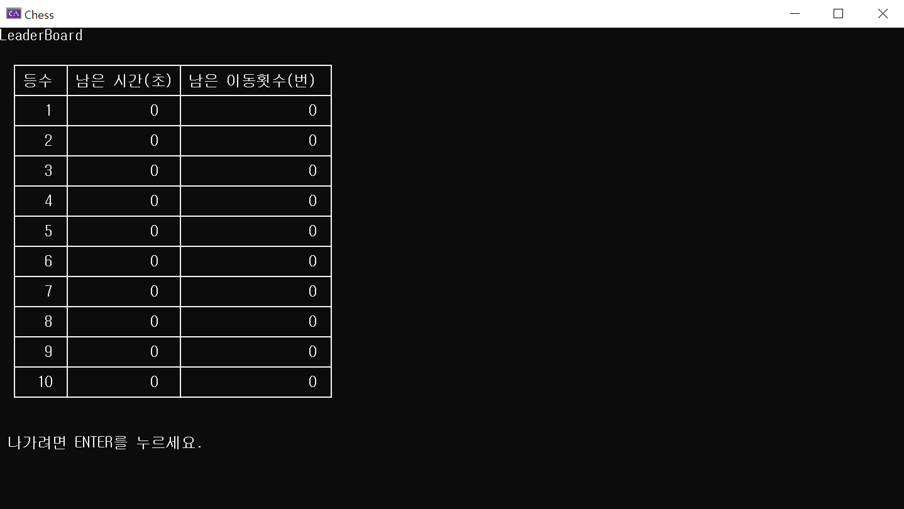

# 보물 찾기(CHESS)

## 🗓️기간
2022.05.02. ~ 2025.06.17.

## ⚙️기술
- C

## 📖소개
프로그래밍을 배우고 처음 진행한 팀 프로젝트입니다.

게임 콘셉트와 스토리 주제는 **체스**입니다.

처음 정했던 프로젝트 주제는 졸업 프로젝트 주제로 이어집니다.

## ✅기능
1. 게임 스토리와 방법 소개
2. 방향키로 게임 진행
3. 난이도 선택
4. 게임 보드 무작위 생성
5. 파일 저장을 통한 순위표

## 🚀실행
소스 코드를 Windows Visual Studio 환경에서 실행합니다.

